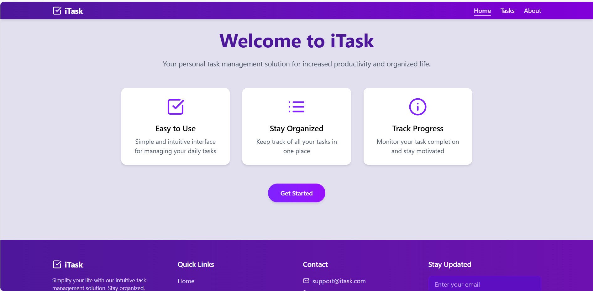
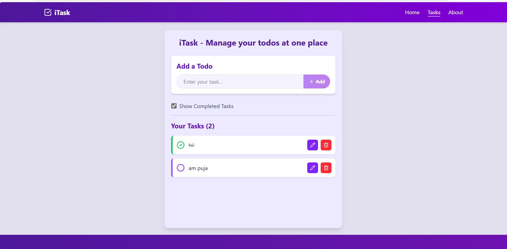

# ✅ ToDo List App – Stay Organized & Productive

[](https://todo-list-app-three-fawn.vercel.app)
[]()

---

## 📝 Overview

**ToDo List App** is a simple yet elegant task management tool built to help you stay organized and increase productivity. Add, mark, and delete your daily tasks with a minimal and intuitive interface.

> 🌟 [Try the Live App](https://todo-list-app-three-fawn.vercel.app)

---

## 🚀 Features

- ➕ Add tasks with ease
- ✅ Mark tasks as completed
- ❌ Delete tasks instantly
- 📱 Fully responsive design
- 🎯 Clean and distraction-free UI
- ⚡ Built with React + TailwindCSS

---

## 🛠️ Tech Stack

- **Frontend:** React.js, Next.js
- **Styling:** Tailwind CSS
- **Deployment:** Vercel

---

## 📸 Screenshots

| Home View | 
|  |
| Task Completed |
|  
| About |
| 
---

## 📂 Folder Structure

```
/pages          # Next.js pages & routing
/components     # Reusable components (e.g., TaskItem, TaskList)
/styles         # TailwindCSS & global styles
/public         # Static assets
```

---

## 🧑‍💻 How to Run Locally

```bash
# Clone the repository
git clone https://github.com/subhasmita-puja/TodoList-APP.git

# Navigate into the project directory
cd todo-list-app

# Install dependencies
npm install

# Start the development server
npm run dev
```

---

## 🌟 Future Enhancements

- 🧠 Task categories & filtering
- 🗓️ Due dates and reminders
- ☁️ LocalStorage or database integration
- 🔄 Drag-and-drop reordering
- 🌙 Dark mode support

---

## 👩‍💻 About the Developer

**Subhasmita Sahoo**  
Frontend Developer | UI/UX Designer | Code Crafter

📍 Khordha, Odisha  
📫 [Email](mailto: subhasmita4602@gmail.com)  
🔗 [Portfolio](#) | 💼 [LinkedIn](https://www.linkedin.com/in/subhasmita-sahoo-puja/) | 💻 [GitHub](https://github.com/subhasmita-puja)

---

## 📝 License

Licensed under the [MIT License](LICENSE).

---

> 💖 Star this repository if you found it helpful!
